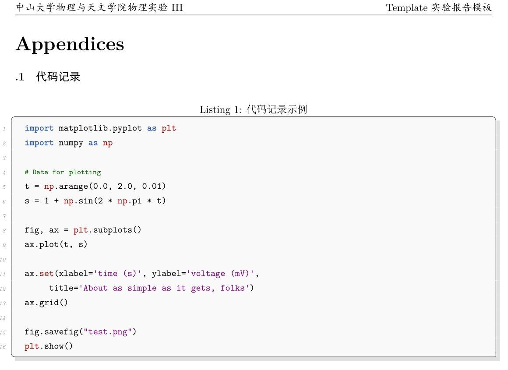
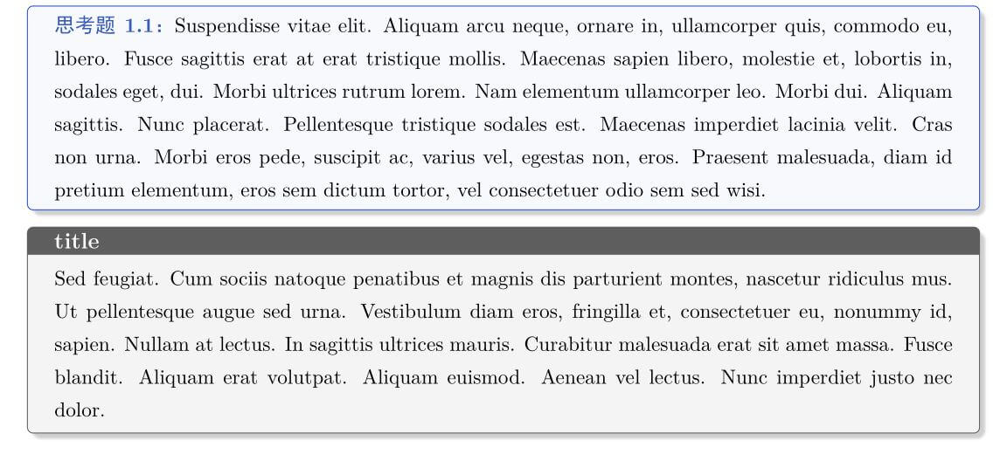
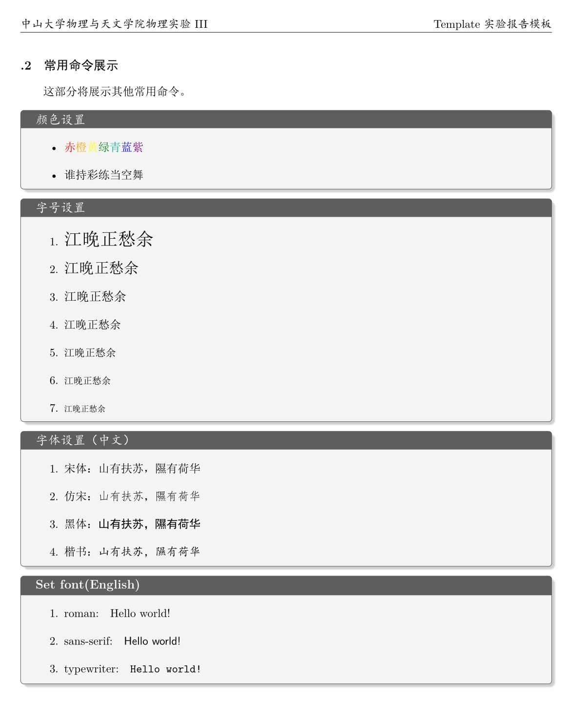

<div align='center'>

# SYSU-SPA-Labreport-Template

<b>School of Physics and Astronomy, Sun Yat-sen University, undergraduate experiment report LaTeX template</b>

 
<p align = "center">

</p>
</div>

Hi, I am Huanyu Shi, an undergraduate student majoring in physics from School of Physics and Astronomy at Sun Yat-sen university, class of 2019.

The inspiration for this template came to me during my sophomore year when I found the Word template provided by the college for writing lab reports to be rudimentary, inefficient, and aesthetically unpleasing. Therefore, I decided to create this LaTeX template based on the format provided by the college, but with improvements.


As graduation approaches, I've realized that this template is still in circulation within the college. However, since the initial version was rather rudimentary and lacked certain features, **I have decided to refine and enhance it, making it available on GitHub and Zhihu for anyone who may find it useful.** I hope it will not only benefit students in our department but also provide a helpful reference for students from other institutions.

You can find the [demo PDF here](https://huanyushi.github.io/assets/pdf/SYSU-SPA-LabReport-Template.pdf) and download the source code from the [release page](https://github.com/huanyushi/SYSU-SPA-Labreport-Template/releases).

## 1. Template Functionality Overview

### 1.1. Updates
After updating and improving the template, in addition to the essential sections of a lab report:

- Cover Page
- Pre-lab Assignment
- Experimental Record
- Analysis and Discussion

I have added the following content:

- **References**: Acknowledging the use of others' knowledge is crucial for maintaining academic integrity.

- **Code Appendix**: This section provides examples of using the Lstlisting environment to display code used in the lab report.

- **Common Commands Display**:  Since some students may be new to LaTeX, this template also includes a display of commonly used commands for easy reference.


### 1.2. Notes
1. References should be imported into the `bib` file, and the compilation sequence should follow `xelatex `-> `bibtex` -> `xelatex` -> `xelatex`. If you want to adjust the style of the references, you only need to modify the `\bibliography{}` command in `main.tex`.
2. The configuration for the lstlisting code environment is as follows, with code imported in the Python language.  You can manually change or add other programming languages, and consult the listings package manual for further configurations.
```latex
\usepackage{listings}
\definecolor{c1}{HTML}{2752C9} % defined color
\lstloadlanguages{python}
\lstdefinestyle{pythonstyle}{
backgroundcolor=\color{gray!5},
language=python,
frameround=tftt,
frame=shadowbox,
keepspaces=true,
breaklines,
columns=spaceflexible,
basicstyle=\ttfamily\small, % basic text settings, font is teletype, size is small
keywordstyle=[1]\color{c1}\bfseries,
keywordstyle=[2]\color{Red!70!black},
stringstyle=\color{Purple},
showstringspaces=false,
commentstyle=\ttfamily\scriptsize\color{green!40!black}, % comment text setting, font is teletype, size is scriptsize
tabsize=2,
morekeywords={as},
morekeywords=[2]{np, plt, sp},
numbers=left, % number of lines of code
numberstyle=\it\tiny\color{gray}, % number font
stepnumber=1,
rulesepcolor=\color{gray!30!white}
}
```

3. This template defines two forms of `box`, which can be modified by referring to the manual of the `tcolorbox` macro package.
```latex
\usepackage{tcolorbox}
\tcbuselibrary{skins,breakable}
\newtcolorbox{tbox}[2][]{
  colframe=black!70!,
  breakable,
  enhanced,
  boxrule =0.5pt,
  title = {#2},
  fonttitle = \large\kaishu\bfseries,
  drop fuzzy shadow,
  #1
}
\newtcolorbox[auto counter,number within=section]{question}[1][]{
  top=2pt,bottom=2pt,arc=1mm,
  boxrule=0.5pt,
  breakable,
  enhanced,
  coltitle=c1!80!gray,
  colframe=c1,
  colback=c1!3!white,
  drop fuzzy shadow,
  title={Thinking~\thetcbcounter：\quad},
  fonttitle=\bfseries,
  attach title to upper,
  #1
}
```

1. TikZ is a well-known drawing package (though its documentation is over 1,000 pages long, making it somewhat challenging to learn). Here, I have included some TikZ examples as a supplement.


## 2. Statement
* This template is for learning and communication only and is not the official template of the college.
* This template will no longer be updated and maintained. If you have any additional needs, please design and change it yourself.
* **Welcome to apply to the School of Physics and Astronomy, Sun Yat-sen University**.

## 3. License
This project is released under the MIT license.